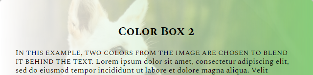

# CSS Color Gradients

This repo is a place for me to experiment with the different types of gradients available in CSS.

Here's one example from the project where two gradients help the image to blend into the background behind the text:

This project serves two main purposes:
1. To better understand *how the gradients work*
1. To think of creative ways to use gradients to *enhance the design of a webpage*